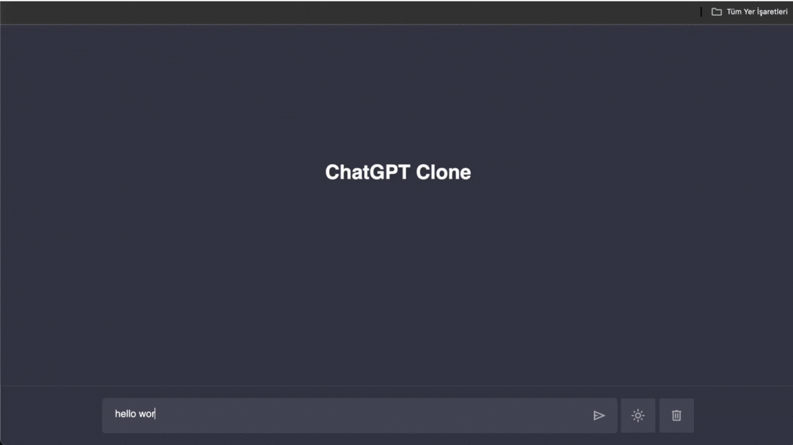

## ChatGPT-Clone

- This project includes a clone of ChatGPT developed using OpenAI's GPT-3 API. Through this application, users can ask ChatGPT various questions and receive meaningful answers in real-time.

- The user interface has a simple and easy-to-use design for users to ask questions and see ChatGPT's answers.

- With ChatGPT, real-time interaction is possible and answers are displayed quickly.

- The application works quickly.

## Used Technologies

- HTML5

- CSS3

- Javascript

- API:https://platform.openai.com/docs/api-reference/edits

## Gif

